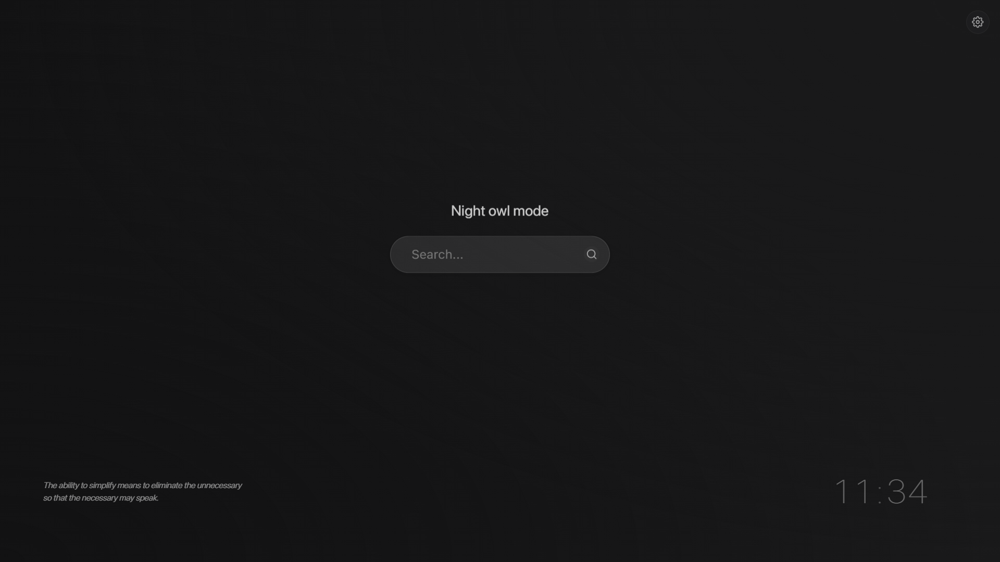
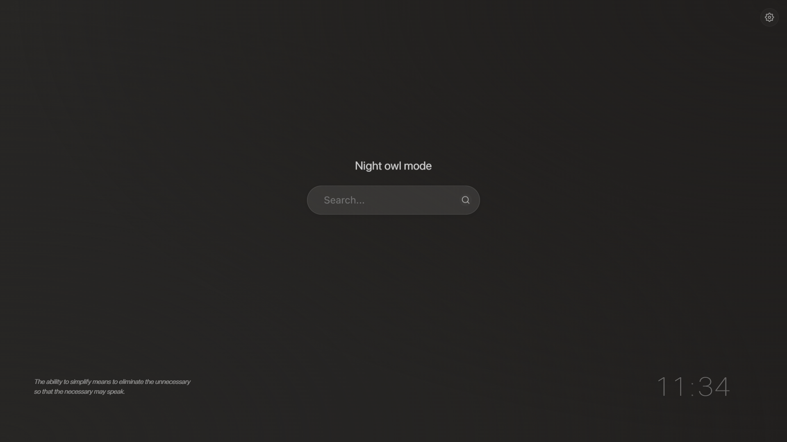

# Noir - Minimal New Tab Extension


A minimal, elegant new tab experience with smart features and beautiful themes. Noir provides a clean, distraction-free new tab page with a focus on aesthetics and functionality.

## Features

- **Elegant Design**: Clean, minimal interface with beautiful dark themes
- **Smart Features**: Context-aware greetings and background patterns
- **Customizable Clock**: Multiple formats and animation styles
- **Quick Search**: Easily switch between search engines
- **Beautiful Themes**: Multiple dark themes with accent colors
- **Background Patterns**: Subtle patterns that adapt to your usage
- **Privacy-Focused**: All data stored locally, nothing sent to servers

## Screenshots




## Installation

### Chrome Web Store

Coming soon! The extension will be available on the Chrome Web Store on May 7, 2025.

### Manual Installation

1. Download or clone this repository
2. Open Chrome and navigate to `chrome://extensions/`
3. Enable "Developer mode" in the top-right corner
4. Click "Load unpacked" and select the downloaded folder
5. The extension should now be installed and will replace your new tab page

## Usage

### Clock & Date

- The clock displays in your preferred format (12h or 24h)
- Hover over the clock to see the date and seconds
- Choose from different animation styles for changing digits

### Search

- Type directly in the search bar to search with your default engine
- Click the search icon to switch between Google, Bing, DuckDuckGo, and Yahoo
- Press `/` to focus the search bar from anywhere on the page
- Press `Alt+S` to open the search engine selector

### Settings

- Click the gear icon in the top-right to open settings
- Customize themes, clock format, search engine, and more
- Enable or disable features like quotes and smart features

## Smart Features

- **Context-Aware Greetings**: Personalized greetings based on time of day and usage patterns
- **Background Patterns**: Subtle patterns that change based on your activity
- **Data Aging**: Automatically clean up old data based on your preferences

## Privacy

Noir respects your privacy:
- All data is stored locally on your device
- No data is ever sent to external servers
- Minimal permissions required to function

## Customization

### Themes

- Classic Dark: A clean, minimal dark theme with blue accents
- Midnight Blue: Deep blue theme with lighter blue accents
- Forest: Dark green theme with emerald accents
- Nord: Popular Nord color scheme
- Claude: Inspired by Claude.ai with terracotta accents

### Clock Formats

- 12-hour with AM/PM
- 24-hour

### Clock Animations

- Fade
- Slide
- Flip
- Bounce

## Development

### Project Structure

```
noir/
├── css/           # CSS styles
├── fonts/         # SF Pro fonts
├── icons/         # Extension and UI icons
├── js/            # JavaScript files
├── patterns/      # SVG background patterns
├── manifest.json  # Extension manifest
└── newtab.html    # Main HTML file
```

### Building From Source

1. Clone the repository
2. Make your changes
3. Load the extension in developer mode

## Contributing

Contributions are welcome! Please feel free to submit a Pull Request.

## License

This project is licensed under the MIT License - see the [LICENSE](LICENSE) file for details.

## Acknowledgments

- SF Pro fonts by Apple Inc.
- Icons from Feather Icons
- Design inspiration from [Claude.ai](https://claude.ai/)
- Special thanks to all beta testers

## Contact

- GitHub: [@mosadd1X](https://github.com/mosadd1X)
- Email: mosaddiqx@gmail.com

---

Made with ❤️ by mosadd1X
